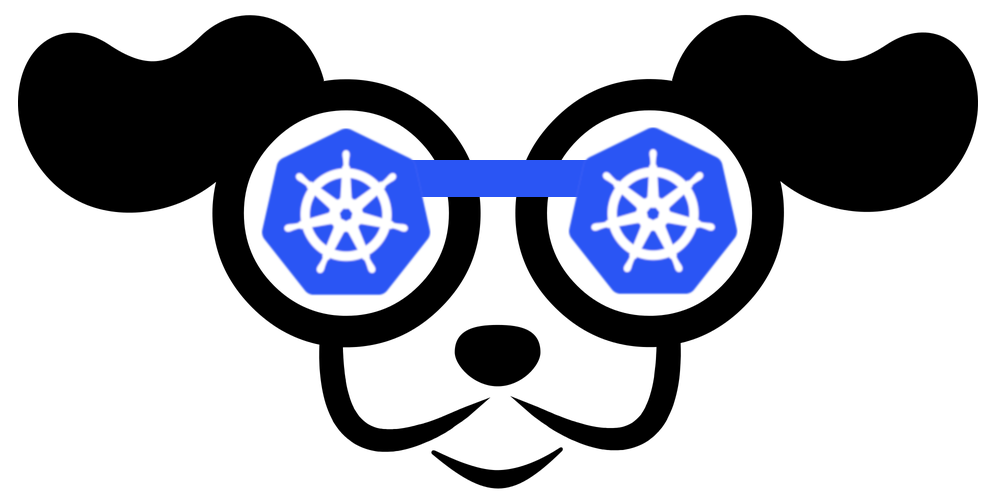
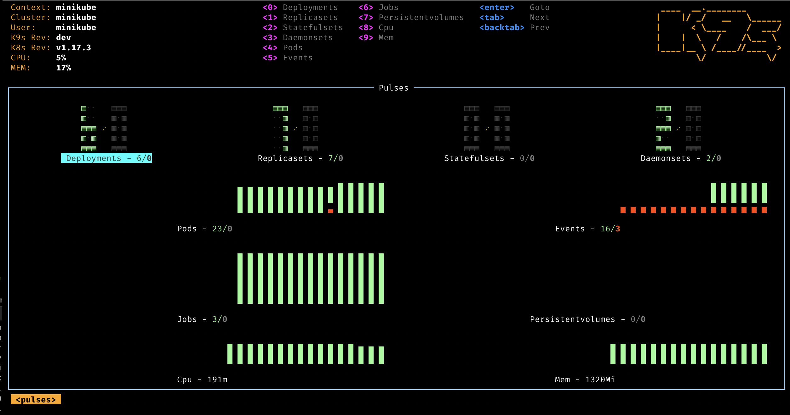
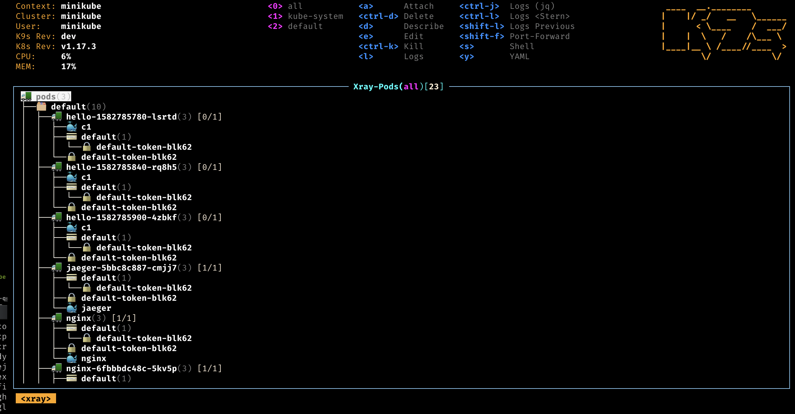
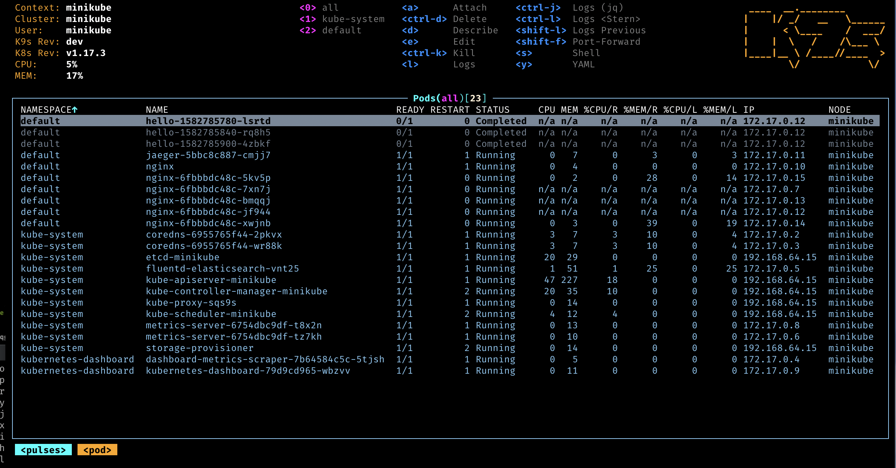
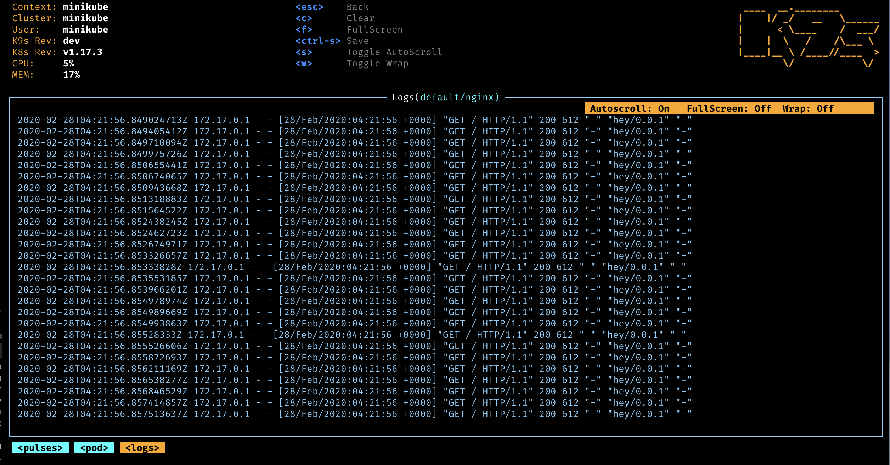
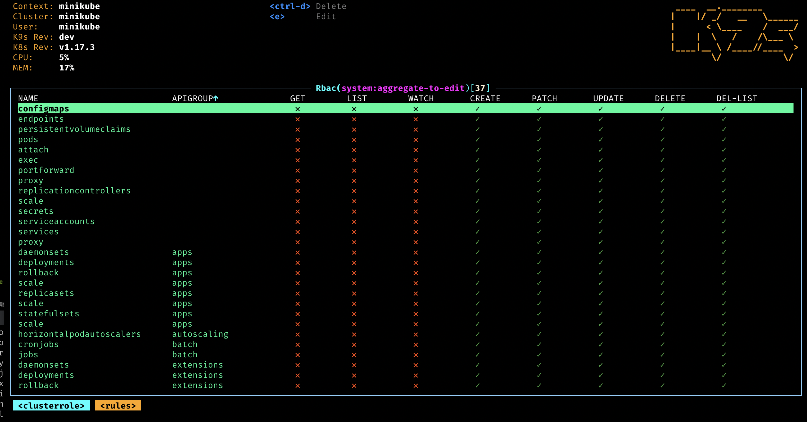

 

# <i class="fas fa-paw"/> Who Let The Pods Out?

K9s is a terminal based UI to interact with your Kubernetes clusters. The aim of this project is to make it easier to navigate, observe and manage your deployed applications in the wild. K9s continually watches Kubernetes for changes and offers subsequent commands to interact with your observed resources.

## <i class="fas fa-highlighter"/> Features

- Information At Your Finger Tips!
  - Tracks in real-time activities of resources running in your Kubernetes cluster.

- Standard or CRD?
  - Handles boths Kubernetes standard resources as well as custom resoure definitions.

- Cluster Metrics
  - Tracks real-time metrics associates with resources such as pods, containers and nodes.

- Welcome Power Users!
  - Provides standard cluster management commands such as logs, scaling, port-forwards, restarts...
  - Define your own commmand shortcuts via command aliases and hotkeys.
  - Supports user custom plugins command to extend K9s with your very own cluster commands.

- Skinnable and Customizable
  - Define your very own look and feel via K9s skins.
  - Customize/Arrange which columns to display on a per resource basis.

- Narrow or Wide?
  - Provides toggles to view minimal or full resource definitions

- Zoomable
  - Drill down directly to what's wrong with your cluster's resources.

- Cluster Overall Views
  - Provides for an overview of your cluster resources via Pulses and XRay views.

- We've got your RBAC!
  - Supports for viewing RBAC rules such as cluster/roles and their associated bindings.
  - Reverse lookup to asserts what a user/group or serviceaccount can do on your clusters.

- Built-in Benchmarking
  - You can benchmark your HTTP services/pods directly from K9s to see how your application fare and adjust your resources request/limit accordingly.

- Quick resource traversal
  - K9s provides for easy traversal of Kubernetes resources and their associated resources.

 

## <i class="fas fa-book"/> Documentation

  * <i class="fas fa-toolbox"/> [Installation]({{ "/topics/install" }})
  * <i class="fas fa-terminal"/> [Commands]({{ "/topics/commands" }})
  * <i class="fas fa-car"/> Custom Feel
    * [K9s]({{ "/topics/config" }})
    * [Aliases]({{ "/topics/aliases" }})
    * [HotKeys]({{ "/topics/hotkeys" }})
    * [Plugins]({{ "/topics/plugins" }})
  * <i class="fas fa-swatchbook"></i> Custom Look
    * [Skins]({{ "/topics/skins" }})
    * [Resource Columns]({{ "/topics/columns" }})
  * <i class="fas fa-tachometer-alt"/> [Benchmarking]({{ "/topics/bench" }})
  * <i class="fas fa-key"/> [RBAC]({{ "/topics/rbac" }})
  * <i class="fas fa-video"/> [Tutorials]({{ "/topics/video" }})

 

## <i class="fab fa-youtube"/> Demos and Screens

- Pulses
  
- XRay
  
- Pods
  
- Logs
  
- RBAC
  

 

## <i class="fas fa-phone-volume"></i> Get In Touch!

* <i class="fas fa-at"/>  [Fernand Galiana](mailto://{{ site.email }})
* <i class="fab fa-twitter"/> [@{{ site.twitter }}](https://twitter.com/{{ site.twitter }}?lang=en)
* <i class="fab fa-github"/> [K9s Repo](https://github.com/{{ site.github }})
* <i class="fab fa-slack"/>  [K9ers Slack](https://k9sers.slack.com/)
* <i class="fab fa-slack-hash"/> [K9ers Slack Invite](https://join.slack.com/t/k9sers/shared_invite/enQtOTA5MDEyNzI5MTU0LWQ1ZGI3MzliYzZhZWEyNzYxYzA3NjE0YTk1YmFmNzViZjIyNzhkZGI0MmJjYzhlNjdlMGJhYzE2ZGU1NjkyNTM)

 

## <i class="fas fa-bullhorn"></i> Sponsor Us!

If you dig this effort, consider clicking the Sponsor button on the K9s Github repository, or just simply give us a shoot-out on social as these go a long way in keeping our batteries charged up!!

 

## <i class="fas fa-exclamation-triangle"></i> Disclaimer

This is still work in progress! If there is enough interest in the Kubernetes community, we will enhance per your recommendations/contributions.

 

## <i class="fas fa-thumbs-up"></i> ATTA Girls/Boys!

K9s sits on top of many open source projects and libraries. Our *sincere* appreciations to all the OSS contributors that work nights and weekends to make this project a reality!

 

---

  © 2020 Imhotep Software LLC. All materials licensed under

<a class="mid-align" href="http://www.apache.org/licenses/LICENSE-2.0">Apache v2.0</a>
